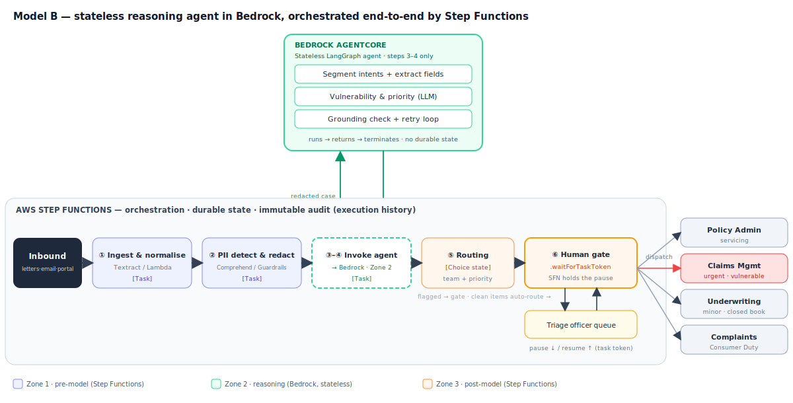

# End-to-End Agentic AI Case Study — Correspondence Triage Agent for Phoenix Life

*Interview prep — Applied AI Architect, Forgd. Problem → Design, then three conflict-resolution STAR stories (one per stakeholder group).*

---

## Context in one line

Phoenix Life (UK long-term life & pensions, FCA-regulated, part of Phoenix Group) receives large daily volumes of inbound customer correspondence — letters, emails, secure-portal messages — covering policy queries, retirement/annuity options, bereavement and death claims, and complaints. A manual triage desk read, classified, prioritised and routed each item. We replaced the read-classify-route step with an **agentic triage system** — a **stateless LangGraph reasoning agent on Amazon Bedrock AgentCore, orchestrated end-to-end by AWS Step Functions** — keeping humans in the loop for anything consequential.

---

## Owning team & routing destinations

The triage agent is a **Customer Operations / Customer Service** capability — it lives at the **front door** where undifferentiated inbound correspondence lands, and its job is to route each item *to* the specialist teams. It can't belong to any one downstream team because it's the thing deciding which team an item is *for*.

Downstream destinations it routes into:
- **Policy Administration (servicing)** — keeping a live policy running: address/premium changes, beneficiary updates, surrender quotes, retirement-option requests, statements, reinstatements.
- **Claims Management** — the payout event: bereavement/death claims, pension death benefits. Highest-stakes, most regulated, most vulnerability-sensitive destination.
- **Underwriting** — only where new risk assessment is triggered; a *minor* destination for Phoenix's largely closed, in-force life & pensions books.
- **Complaints / Consumer Duty** — dissatisfaction and fair-treatment cases.

**Servicing vs claims — the distinction that drives routing.** Servicing keeps a *live* policy running for the *policyholder*; claims pays out when the *insured event* occurs, usually to a *beneficiary*.

*Worked example.* Margaret Hughes holds a Phoenix With-Profits Whole of Life policy (£45,000 sum assured, beneficiary: husband David) and a Phoenix personal pension (~£120,000).
- *"I'd like to update my address / change my payment date / what's my surrender value?"* → **Policy Administration (servicing)** — administration on a live policy, no benefit paid out.
- *"I'm writing to inform you my mother has passed away."* → **Claims Management**, flagged **urgent + vulnerable** — the insured event has occurred; now verify the death certificate, confirm beneficiary/identity, check terms, calculate the payable amount (sum assured + terminal bonus), handle probate, and settle to David.

Same front door, very different downstream teams and obligations — which is exactly why early, accurate triage of a bereavement claim matters for Consumer Duty.

---

## Problem

The manual triage desk was the bottleneck. Concretely:

- **Slow, inconsistent routing.** Items sat in a shared queue; classification depended on which agent picked it up. Misroutes bounced between teams and burned SLA days.
- **SLA and Consumer Duty exposure.** Time-sensitive items (bereavement claims, complaints, vulnerable-customer signals) were not reliably surfaced early, creating fair-treatment and SLA-breach risk.
- **Vulnerable customers detected too late.** Signals of vulnerability (bereavement, financial hardship, health, cognitive difficulty) were often only spotted once a human eventually read the item — sometimes days in.
- **No structured data at intake.** Free-text correspondence wasn't turned into structured fields, so downstream teams re-keyed information and reporting was weak.
- **Cost and scale.** Volume was growing faster than headcount; triage was low-value, high-toil work.

The business ask: cut time-to-correct-team, catch vulnerability and priority signals at intake, and produce clean structured metadata — **without** making unfair automated decisions on regulated customers.

---

## Design

### Solution shape (Model B — Step Functions orchestrates, agent reasons)
A **supervised, multi-stage pipeline**, not a single free-roaming autonomous agent. **AWS Step Functions is the outer orchestrator** and owns durable state, error handling, routing (a **Choice** state), the human gate (**`.waitForTaskToken`**), and the audit trail (its own execution history). The **agentic reasoning is a stateless LangGraph agent on Bedrock AgentCore**, invoked as a single Step Functions Task — it runs, returns schema-bound output, and terminates with no durable state of its own. LangGraph earns its place only for the genuinely agentic reasoning (multi-intent decomposition, grounding-retry loops); everything deterministic lives in Step Functions. Each inbound item flows through:

1. **Ingest & normalise** — OCR/parse (letters, email, portal), strip to text, attach metadata (channel, policy ref if present).
2. **PII detection & minimisation layer** — deterministic + managed detection (e.g. Amazon Comprehend / Bedrock Guardrails) tags and where possible redacts special-category data before it hits the reasoning model; raw documents never leave the trust boundary.
3. **Classification & extraction node** — a LangGraph node calling a Bedrock-hosted foundation model to assign case type, urgency, and extract structured fields (policy number, claim type, key dates, requested action). Runs against a RAG store of policy/product context and the routing taxonomy.
4. **Vulnerability & priority check** — a dedicated grounded check flags vulnerability indicators and Consumer-Duty-sensitive cases; anything flagged is **escalated to a human, never auto-actioned**.
5. **Routing recommendation** — proposes destination team + priority with a rationale and confidence.
6. **Human-in-the-loop gate** — low-confidence, vulnerable, complaint, or high-value items are held for triage-officer confirmation; high-confidence, low-risk items can be auto-routed under policy.
7. **Full audit trail** — every input, model version, prompt, output, confidence, and human action is logged immutably for the DPO, compliance, and internal audit.

### Pipeline diagram

### Zone / trust-boundary model — two orthogonal axes (don't conflate them)

**Axis 1 — logical data-flow trust stages (the zones):**
- **Zone 1 (deterministic, pre-model):** PII detection/redaction, input validation, prompt-injection defence on document text.
- **Zone 2 (the reasoning agent):** the LangGraph extraction/vulnerability/grounding nodes — *probabilistic model calls wrapped in deterministic LangGraph control* (fan-out, retry). Not purely probabilistic.
- **Zone 3 (deterministic, post-model):** routing policy, confidence thresholds, human-gate logic, dispatch.

**Axis 2 — deployment trust domains:** there are only **two** — the **stateless agent inside Bedrock** (= Zone 2), and the **client-owned Step Functions environment** (= Zones 1 **and** 3). Zone 1 and Zone 3 are the *same* deployment domain, wrapped around the single Bedrock call. So the zones are *not* deployment boundaries — and the Z1→Z2 and Z2→Z3 transitions are hard **SFN↔Bedrock service boundaries**, which is exactly where input minimisation and the output schema-guard live.

### Key architectural decisions
- **Step Functions orchestrates; the LangGraph agent only reasons.** The stateless agent runs on Bedrock AgentCore with the LLM served by Amazon Bedrock in-region (UK/EU) for data-residency; no customer data used for training; VPC-private inference. Durable state, routing, human gate and audit live in Step Functions (client-owned), so regulated actions and raw identifiers never sit inside the AI runtime.
- **No automated "significant decision."** Triage *routes and prioritises*; it does not decide claims, pricing, or eligibility — routing a case to a team has no legal/significant effect, so it sits outside the automated-significant-decision rules entirely. Note: under the UK's **Data (Use and Access) Act 2025** (s.80, replacing Art 22 with Arts 22A–22D, in force 5 Feb 2026) an automated *claim decision* is no longer outright prohibited — it's permitted with a lawful basis + safeguards (inform, human intervention, contest). We still kept a human on any real decision **by design/risk choice**, not legal necessity: bereavement claims routinely involve special-category health data (higher bar) and Consumer Duty + reputational risk made human-in-the-loop the defensible option. (EU GDPR Art 22 was *not* reformed — the old "prohibited unless" model still applies there.)
- **Grounded extraction only** — every extracted field must cite the span it came from; ungrounded output is rejected, keeping hallucination out of the customer record.
- **Evals before autonomy** — a labelled gold set of historical correspondence gates any increase in auto-routing scope. Autonomy expands only where measured accuracy clears a governance-agreed bar.

---

## Conflicts & resolution — three STAR stories (one per stakeholder group)

*Three genuine conflicts I navigated on this build — real disagreements, not just requirements. Each in Situation / Task / Action / Result.*

### 1. Enterprise Architecture team (standards & governance) — "no AI decisions; humans must review everything"

**Situation.** The client's EA/governance team, who own the standards catalogue and ARB sign-off, opened with a hard line: an LLM must not make *any* routing decision — every case had to be 100% human-reviewed — because they read "AI deciding where a regulated case goes" as a GDPR Article 22 automated-decision risk. Taken literally, that gutted the business case; the entire point was to cut manual triage.

**Task.** Get governance comfortable enough to allow *meaningful* automation without weakening the control they were rightly protecting — and do it collaboratively, since they held the go/no-go and going over their heads would have poisoned the engagement.

**Action.** I didn't argue for more autonomy head-on. I reframed the risk *with* them: triage only *routes and prioritises*, it doesn't decide eligibility or payment, so it isn't an automated "significant decision" at all (routing a case to a team has no legal/significant effect on the customer). Then I moved the disagreement onto architecture they could trust — **"model informs, code enforces"**: the LLM only reasons (stateless, inside Bedrock), while routing and the human gate live in **Step Functions as deterministic states they controlled**, with the SFN execution history as an immutable, replayable audit trail. I proposed **graduated autonomy** — auto-route only the high-confidence, low-risk tail, widening only as an eval set cleared a bar *they* set — and mapped every control to their own standards catalogue so they signed against something familiar.

**Result.** Governance signed off. We shipped automation on the safe tail with a defensible Art. 22 position, a boundary they helped define, and an eval-gated path to widen it. The conflict turned them from a blocker into a co-owner of the control model.

### 2. Project architects — "this is over-engineered: two orchestrators doing the same job"

**Situation.** In design review the project architects — who'd own the system long-term — pushed back hard: *"Why LangGraph and Step Functions? They both do human-in-the-loop; that's redundant orchestration. Pick one."* A direct challenge to my design, and they weren't wrong that the two mechanisms overlapped.

**Task.** Resolve a real technical disagreement with the engineers who'd maintain the system — without caving to a worse design or dismissing a valid point.

**Action.** I conceded the part they were right about: the overlap between LangGraph's interrupt/checkpoint and SFN's `.waitForTaskToken` was real, so I **removed it** — by making the agent **stateless**, so there was no second checkpoint to reason about. Then I made the boundary explicit and gave each tool one job: Step Functions owns durable orchestration and the human gate; LangGraph is confined to the reasoning core and justified *only* where the reasoning is genuinely agentic (multi-intent, grounding-retry). Crucially I put the decision back to the data — a **documented fallback**: if the mail-mix proved mostly clean single-intent, we'd drop LangGraph and call Bedrock directly. That turned it from me defending a framework into a measurable criterion we both accepted.

**Result.** The architects endorsed the design *because* they helped draw the boundary, and owned it afterward. We avoided both the over-engineering they feared and the hidden fragility of collapsing everything into one tool. Conceding the valid half was what won the whole.

### 3. Project delivery lead — "your evals and human-gating are scope creep; we need to ship"

**Situation.** The delivery lead, accountable for the timeline and the ops desk's capacity, wanted to auto-route aggressively from day one to hit the date and show ROI, and saw my insistence on an eval harness plus human-in-the-loop as scope creep that would slow delivery.

**Task.** Protect the safety/governance floor (without which the ARB wouldn't sign) while genuinely respecting the delivery pressure — not win an argument, but land a plan we both backed.

**Action.** I stopped framing it as safety-vs-speed and found the slice that served both: **phased autonomy.** Ship on the timeline, but with auto-routing scoped to a small, high-confidence, low-risk tail while humans handle the rest. I reframed the eval harness not as overhead but as the *mechanism that lets autonomy grow* — so it served his ROI goal over the following quarters rather than fighting it. I showed that `.waitForTaskToken` means paused cases consume no compute, so gating didn't hurt throughput or cost. And I gave him a shared, visible metric — **straight-through rate** — so "are we delivering value" had a number we both watched.

**Result.** We shipped on schedule with real automation on the safe tail and a demonstrable win for the delivery lead, then widened the envelope post-launch as evals earned it. The eval work he'd called scope creep became the thing that let him report rising automation month over month.
